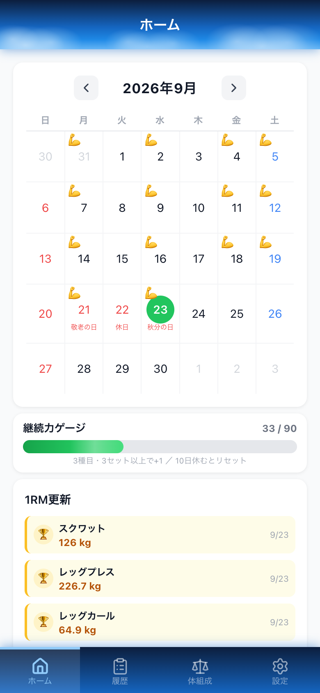
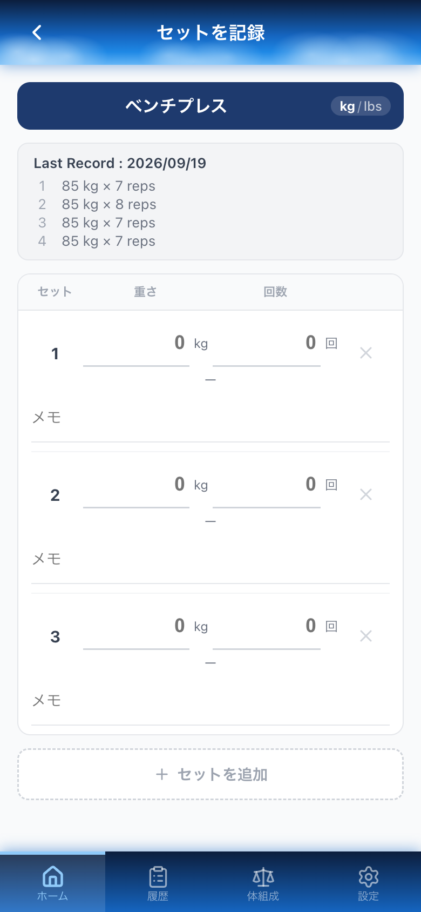
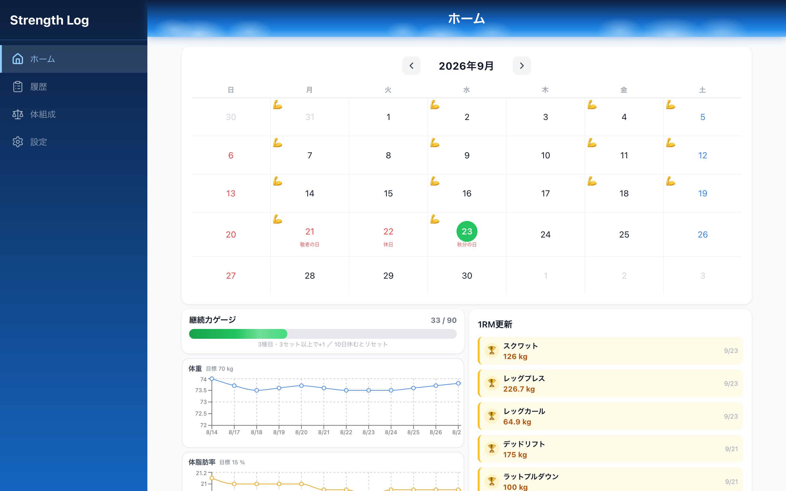

# Strength Log

筋力トレーニングの記録アプリです。日々のセット（重量 × 回数）を記録し、推定1RM・継続日数・体組成の推移で「続けられているか」が一目で分かることを目指しました。

**公開URL: https://training-log-two.vercel.app**

スマートフォンでの利用を主に想定しています（PC 幅にも対応）。アカウント登録は不要で、開いてすぐ試せます。**設定画面の「サンプルデータを入れる」を押すと、約1か月ぶんの記録が入った状態で一通りの画面を試せます。**

| ホーム（スマホ） | セットの記録（スマホ） | ホーム（PC） |
|---|---|---|
|  |  |  |

## 主な機能

- **カレンダー** — トレーニングした日にマークを表示。日本の祝日にも対応
- **セットの記録** — 種目ごとに重量・回数・メモを記録。前回の記録を同じ画面に表示し、重量を伸ばしやすくしています
- **推定1RM** — Epley 式で1回挙上重量を推定し、種目ごとの自己ベストを更新したら演出で知らせます
- **継続力ゲージ** — 「3種目・3セット以上」を達成した日を積み上げ、一定日数空くとリセットされる独自の指標。達成条件は設定から変更できます
- **履歴** — 種目・部位で絞り込み、最大重量／最大1RM／セット数／総負荷量の推移をグラフで表示
- **体組成** — 体重・体脂肪率・筋肉量・腹囲を記録し、目標値を基準線としてグラフに表示
- **種目の管理** — 既定39種目に加えて自由に追加可能。種目の解説は日本語 Wikipedia から取得し、フォーム動画へのリンクも表示
- **単位の切り替え** — kg / lbs（保存は常に kg、表示時のみ換算）
- **バックアップ** — 記録・種目・設定をまとめて1つの JSON に書き出し、別の端末で取り込めます
- **使い方（取扱説明書）** — 設定画面から開ける9項目の説明。継続力ゲージの条件など、画面だけでは伝わらない仕組みを解説しています
- **サンプルデータ** — 設定画面から約1か月ぶんの記録を投入。データは今日を基準に生成するので、いつ開いても直近の記録として表示されます（記録がある場合はこの項目を表示せず、既存データを上書きしないようにしています）

## 技術スタック

| 分類 | 使用技術 |
|---|---|
| フロントエンド | React 18 / TypeScript 5.4（`strict: true`） |
| ビルド | Vite 4（`@vitejs/plugin-react-swc`） |
| ルーティング | React Router 7 |
| スタイル | CSS Modules |
| グラフ | Recharts |
| 日付 | date-fns / `@holiday-jp/holiday_jp` |
| アイコン | lucide-react |
| テスト | Vitest / Testing Library（582件） |
| 外部API | 日本語 Wikipedia REST API（種目の解説文・画像） |
| ホスティング | Vercel（`main` へのマージで自動デプロイ） |

データはブラウザの localStorage に保存しています。サーバーもデータベースも持たないため、アカウント登録なしで即座に試せる代わりに、データは端末内にとどまります。端末を移るときのために、書き出し・取り込みを用意しています。

## 設計で気をつけたこと

**集計の基準を1箇所に集約する**
「記録あり」の判定を各画面が独自に書いていたため、同じ日でも画面によってセット数が食い違っていました。`isFilledSet`（回数が1以上のセットだけを数える）を唯一の基準とし、カレンダー・継続力ゲージ・履歴・日付詳細のすべてがこれを通るようにしています。重量0の自重種目を除外しないよう、判定は重量ではなく回数で行います。

**単位換算を表示の直前に1回だけ行う**
保存は常に kg、表示時に `displayWeight` / `displayVolume` を通します。集計の途中で丸めると、換算を挟んだときに画面ごとに数値がずれるため、丸めは表示の1回に限定しています。

**入力途中の状態と保存データを混ぜない**
記録画面を開いただけでは保存せず、値が入力された時点で初めて記録を作ります。画面を開くだけで空の記録が増えると、継続日数などの集計が実態とずれるためです。

**モバイルファースト**
900px 未満ではサイドバーを下部タブバーに切り替え、本文は最大960pxで中央寄せします。ジムでの片手操作を想定し、入力欄とボタンのタップ領域は44px以上を確保しています。

**アクセシビリティ**
すべての入力欄を見出しの文字と `<label>` で結び、画面読み上げで何の欄か伝わるようにしています。カレンダーの日付や種目は、クリックだけでなくキーボードでも選べる要素（ボタン・リンク）で作り、「9月23日（水）、秋分の日、記録あり」のように状態まで読み上げます。モーダルは開くと中にフォーカスを移し、Tab で外に出ず、Esc で閉じ、閉じたら元の場所へ戻します。文字色は全画面を計測し、WCAG AA のコントラスト比 4.5:1 を満たすよう調整しました。

**データを失う経路を塞ぐ**
保存先がブラウザしかないため、壊れたデータを読んでもアプリが停止しないようにしています。読み込み時に形を検証し、壊れた値は別のキーに退避してから既定値で起動します（捨てずに残すので後から取り出せます）。保存に失敗したときも握りつぶさず利用者に伝えます。

## 開発の進め方

機能単位でブランチを切り、プルリクエスト経由で `main` にマージしています。変更はテストで保護し、`main` へのマージで Vercel に自動デプロイされます。

不具合の修正では、まず再現するテストを書いて失敗させ、修正後に通ることを確認してから残しています。

## ローカルでの実行

```bash
npm ci
npm run dev      # 開発サーバー（http://localhost:5173）
npm test         # テスト（582件）
npm run build    # 型チェック + 本番ビルド
```

Node.js 18 以上が必要です。

## 今後の予定

機能を増やすより、いまある機能の完成度を上げることを優先しています。

- 初回表示の軽量化（グラフ・祝日ライブラリの遅延読み込み）

ルーティン（テンプレート）・インターバルタイマー・PWA 化は、上記のあとに検討します。
